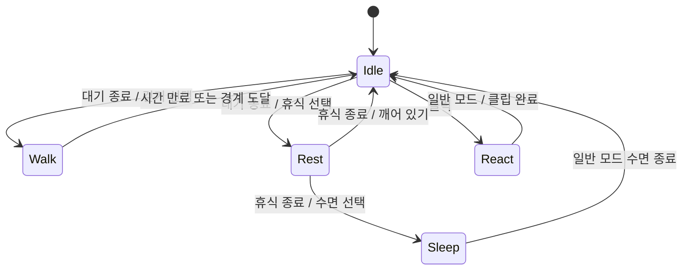
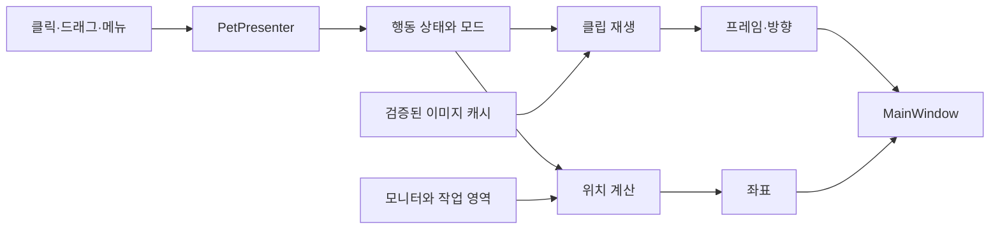

# DesktopPet 동작 정의 및 구현 구조

작성일: 2026-09-21 · 상태: 구현 전 설계 제안

이 문서는 성장 시스템 없이, 작은 펫이 자연스럽게 생활하고 사용자에게 반응하는 버전을 정의한다. 레벨·경험치·친밀도·배고픔·출석 보상은 도입하지 않는다. 기존 아이디어 문서의 성장 관련 제안보다 이 문서의 범위를 우선한다.

현재 구현된 것은 투명 창, 원 자리표시자, 드래그, 좌우 배회다. 아래 클래스·상태·설정은 추가 구현할 설계이며 현재 존재하는 기능이 아니다.

이미지 제작 계약은 [DESKTOP_PET_ASSET_GUIDE.md](DESKTOP_PET_ASSET_GUIDE.md)를 따른다.

## 1. 기본 경험

펫은 대기하다가 잠깐 걷고, 앉아서 쉬거나 잠든다. 짧게 클릭하면 반응하고, 끌면 옮길 수 있다. 우클릭 메뉴와 트레이에서 움직임과 표시를 제어한다.

첫 버전은 드래그한 높이를 유지하는 자유 배치를 제안한다. 아래로 떨어지는 물리 효과나 다른 창에 올라가는 동작은 만들지 않는다. 최초 실행 때만 화면 작업 영역 하단에 배치한다.

## 2. 동작 정의

시간과 확률은 첫 사용성 검증을 위한 시작값이다. 이미지 재생 한 주기와 행동 유지 시간은 별개다.

| 상태 ID | 의미와 이미지 | 진입 조건 | 유지·이동 | 종료 조건과 다음 상태 |
|---|---|---|---|---|
| Idle | 서서 숨쉬고 눈을 깜박임 | 시작, 다른 행동 완료 | 8~20초, 제자리, 반복 | 만료 시 Walk 또는 Rest |
| Walk | 좌우로 걷기 | Idle에서 선택 | 3~7초, 40 DIP/초 제안, 반복 | 시간 만료 시 Idle; 경계에서는 정지 후 Idle |
| Rest | 앉아서 편안하게 쉬기 | Idle에서 선택, 고정 모드 진입 | 15~40초, 제자리, 반복 | 일반 모드에서는 Idle 또는 Sleep |
| Sleep | 몸을 낮추고 수면 | Rest에서 선택, 집중 모드 진입 | 30~90초, 제자리, 반복 | 일반 모드에서는 Idle; 집중 모드에서는 유지 |
| React | 클릭·쓰다듬기에 기분 좋게 반응 | 짧은 클릭 또는 메뉴 명령 | 클립 1회, 제자리 | 일반 모드는 Idle, 고정 모드는 Rest, 집중 모드는 Sleep |
| Drag | 들려서 옮겨지는 자세 | 왼쪽 버튼을 누르고 드래그 문턱 초과 | 포인터에 따른 위치 이동, 자동 이동 없음 | 놓기·취소 시 위치 보정 후 모드 기본 상태 |

걷기 방향은 상태를 두 개로 늘리지 않고 `Facing = Left | Right`로 분리한다. 첫 버전에서 별도 Turn 상태는 만들지 않는다. 경계 도달 후 Idle로 쉬고 다음 Walk에서 화면 안쪽으로 걷는다.

앉기·일어나기·잠들기 전환 클립은 2차 품질 개선 항목이다. 초기에는 기준점을 맞춘 정지 자세 전환으로 시작하며, 전환이 어색한지는 실제 크기에서 확인한다.

### 자동 선택 규칙

- 일반 모드의 Idle 종료: Walk 35%, Rest 65%.
- 일반 모드의 Rest 종료: Idle 75%, Sleep 25%.
- 일반 모드의 Sleep 종료: Idle.
- 지속 시간은 상태 진입 시 한 번 정하고, 다음 상태 추첨은 종료 때 한 번만 한다.
- 이동할 수 없는 좁은 작업 영역에서는 Walk 대신 Rest를 선택한다.
- 방향은 Walk 진입 시 결정한다. 경계에 있다면 안쪽을 선택하고 그 외에는 좌우를 선택한다.
- 상태 진입 시 클립을 시작한다. 반복 클립의 1회 재생 완료는 행동 종료로 취급하지 않는다.



도식은 일반 모드의 대표 흐름이다. 모든 표시 상태에서 가능한 입력과 모드 전환은 아래 규칙을 적용한다.

## 3. 행동과 운영 모드 분리

| 운영 모드 | 허용되는 자율 행동 | 사용자 입력 |
|---|---|---|
| Normal | Idle, Walk, Rest, Sleep | 클릭 반응, 드래그, 메뉴 |
| Stay | Rest 유지, 자동 배회 없음 | 클릭 반응 후 Rest, 드래그 가능 |
| Focus | Sleep 유지, 자동 배회 없음 | 명시적인 클릭 반응 후 Sleep, 드래그 가능 |

모드는 하나만 선택한다. Stay에서 Focus로 바꾸면 Focus가 되고, Normal을 선택하면 Idle부터 재개한다.

숨김은 운영 모드가 아니라 표시 여부다. 숨기면 행동·이동·프레임 시계를 중단한다. 다시 표시하면 저장된 모드의 기본 상태로 시작하며 숨겨져 있던 시간을 한꺼번에 진행하지 않는다. 재실행 시에는 펫을 보이게 한다.

### 입력 우선순위와 중단

1. 종료: 모든 갱신 중단 및 정리.
2. 숨김·시스템 일시중단: Drag도 안전하게 종료하고 시계 중단.
3. 활성 드래그: 자동 행동과 클릭 반응보다 우선.
4. 메뉴 표시: 이동·행동 시간을 잠시 멈춤.
5. 사용자가 선택한 모드 변경 및 교감 명령.
6. 자동 행동 선택.

React 도중 반복 클릭은 무시해 클립이 처음부터 계속 재시작되지 않게 한다. 요청을 무한 큐에 쌓지 않는다. 드래그는 React를 중단할 수 있다.

메뉴를 닫을 때 명령이 없으면 정지했던 상태와 남은 시간을 이어간다. 모드 변경·교감 명령이 있으면 해당 상태로 전환한다. 절전 복귀는 남은 시간을 따라잡지 않고 모드 기본 상태로 초기화한다.

### 클릭과 드래그

- 버튼을 누를 때는 아직 React를 실행하지 않는다.
- 누른 위치에서 시스템 드래그 기준 거리 이상 이동하면 Drag로 전환한다.
- Drag가 발생하지 않은 채 버튼을 떼면 React를 실행한다.
- 드래그 종료·취소·입력 캡처 상실에서 모두 드래그 플래그를 해제한다.
- Sleep 중 클릭은 즉시 React로 반응한다. 별도 기상 클립은 후속 개선이다.
- 드래그 종료 후 현재 모니터의 보이는 작업 영역 안으로 보정한다. Stay·Focus 설정은 유지한다.

## 4. 좌표와 화면 배치

창 좌표는 DIP, 원본 이미지와 프레임 좌표는 픽셀로 구분한다. 기존 `SpeedPixelsPerSecond`도 구현 시 DIP 의미를 드러내는 이름으로 정리한다.

- 런타임 위치 기준은 고정 캔버스의 왼쪽 위다. 시각적인 발바닥은 이미지 공통 기준점으로 맞춘다.
- 표시 캔버스 기본값은 160×160 DIP로 제안한다.
- 최초 하단 배치: `Top = 작업 영역 Bottom - 기준점 Y × 표시 크기 / 프레임 크기`.
- 이미지 계약상 기준점 아래는 투명 여백으로 둔다. 보이는 발이 작업 영역 하단에 맞게 한다.
- 좌우 경계는 캔버스 전체 너비로 계산하여 안전 여백을 확보한다.
- 현재 모니터 선택, 작업 영역, DPI 변환은 화면 배치 서비스 한 곳에서 처리한다.
- 모니터가 사라지거나 설정 위치가 화면 밖이면 주 모니터의 보이는 위치로 복구한다.
- 유효 폭이 펫보다 작으면 표시 크기를 화면에 맞추거나 이동을 중단한다. 좌우 반전이 끝없이 발생하지 않게 한다.

## 5. 구현 구조

현재 단일 프로젝트를 유지한다. 별도 엔진 프로젝트나 범용 플러그인 시스템은 필요하지 않다. 아래는 기능을 구현하면서 나눌 책임이며 한 번에 빈 클래스를 모두 만들 필요는 없다.

```text
DesktopPet/
  App.xaml.cs                       시작, 설정 로드, 종료 조율
  MainWindow.xaml / .xaml.cs         Image 표시, 입력 전달, 창 위치 반영
  Presentation/
    PetPresenter.cs                 상태·이동·프레임 결과를 View에 연결
  Behavior/
    PetBehaviorController.cs        상태 전환, 모드, 지속 시간, 입력 우선순위
    PetState.cs                     상태 ID와 Facing, PetMode
  Animation/
    PetAnimationPlayer.cs           클립 시간 → 프레임, 1회 완료 알림
    PetAssetLoader.cs               정의 파일 검증, 이미지 로드와 캐시
    PetAssetDefinition.cs           클립·프레임·크기·기준점 데이터
  Services/
    DesktopPlacementService.cs      모니터 작업 영역, DPI, 화면 밖 복구
    PetSettingsStore.cs             CFG 로드·검증·저장
    TrayService.cs                  메뉴, 숨김 복구, 종료 명령
  PetWanderMovement.cs              위치 계산만 담당, 기존 클래스 활용
  Assets/Pets/default/             character.json 및 동작 이미지
```



### 책임 경계

- 행동 제어기는 WPF Window나 이미지 파일을 알지 않는다. 상태·방향·이동 여부만 결정한다.
- 이동 계산기는 다음 위치와 경계 도달 여부를 돌려준다. 현재의 내부 방향 반전 방식은 상위 행동 제어기와 방향 소유권이 중복되지 않도록 조정해야 한다.
- 애니메이션 재생기는 위치를 변경하지 않는다. 클립별 프레임 시간으로 현재 프레임을 결정한다.
- 상태를 나갈 때 이전 1회 클립의 완료 알림을 무효화한다. 중단된 React의 완료 알림이 Drag를 끝내지 않게 한다.
- Presenter는 실행 흐름만 조율하고, 창 조작은 View의 UI 경로에서 수행한다.
- TrayService와 View는 동일한 명령 경로를 사용한다.

### 시간과 자원

- 경과 시간은 시스템 시각 변경에 영향받지 않는 시계로 측정한다.
- 긴 지연 뒤 이동량을 한 번에 반영하지 않는다. 이동용 delta는 예를 들어 최대 100ms로 제한하고, 절전·숨김 복귀에서는 기준 시각을 재설정한다.
- 걷는 동안 화면 갱신은 30fps부터 사용성을 확인한다. 이미지 클립은 6~10fps로 별도 계산한다. 대기·수면에는 필요한 프레임 시점 위주로 갱신한다.
- 한 갱신 소유자가 상태·이동·프레임을 순서대로 조율한다. 상태마다 별도 타이머를 만들지 않는다.
- 이미지 로드와 설정 I/O는 반복 UI 갱신에서 제외한다. WPF에 전달할 이미지 객체는 스레드 간 전달 가능 여부를 검토하여 준비한다.
- 종료 시 타이머·이벤트·트레이 자원을 소유한 객체가 정리한다.

## 6. CFG 저장 범위

현재 저장소에 CFG 구현이나 `IConfigSnapshotProvider`는 없다. 존재한다고 가정해 호출하지 않는다. 첫 설정 구현 때 이 프로젝트에 맞는 작은 계약부터 정의한다.

| 설정 | 기본값·검증 | 저장 정책 |
|---|---|---|
| SchemaVersion | 1 | 호환성 판단에 사용 |
| CharacterId | default | 없는 캐릭터는 기본 캐릭터로 복구 |
| DisplaySizeDip | 160, 허용 80~240 | 사용자 변경 시 저장 |
| AlwaysOnTop | true | 변경 시 저장 |
| Mode | Normal | Stay·Focus 포함, 알 수 없는 값은 Normal |
| 위치·모니터 정보 | 최초에는 하단 배치 | 드래그 완료·화면 복구 시 저장, 로드 시 화면 검사 |

현재 프레임·일시적인 React·Drag·남은 행동 시간·숨김 여부는 저장하지 않는다. 성장 데이터도 없다. 행동 지속 시간과 가중치는 초기에는 버전 관리되는 내부 기본값으로 둔다. 사용자 설정으로 노출할 때 CFG에 포함한다.

CFG는 사용자별 쓰기 가능한 앱 데이터 위치에 둔다. 누락 시 기본값, 손상 시 원본 보존과 기본값 복구를 적용한다. 저장은 임시 파일 후 교체하는 방식으로 설계하고, 변경을 모아 순차 저장한다. 종료 시 마지막 저장을 기다리되 UI를 동기 대기로 막지 않는다. 더 높은 스키마 버전의 파일은 무조건 덮어쓰지 않는다.

## 7. 구현 순서와 완료 기준

1. **이미지 표시:** 기준 Idle 이미지 한 장 → 실제 표시 크기·투명도·발 기준점 확인.
2. **재생:** Idle과 Walk → 방향·루프·속도·경계 동작 확인.
3. **행동:** Rest·Sleep·React·Drag → 상태 전환과 입력 중단 확인.
4. **상시 실행:** 트레이·숨김·모드·설정 → 재실행과 절전 복귀 확인.

검증은 아래 동작에 집중한다.

- 일반 모드에서 걷기와 휴식이 번갈아 나오고 프레임마다 상태가 바뀌지 않는다.
- 클릭은 한 번 반응하며 드래그가 클릭으로 잘못 처리되지 않는다.
- 드래그·숨김·메뉴 중 자율 이동이 발생하지 않는다.
- 1회 클립이 정확히 한 번 완료되고 중단된 클립의 완료가 새 상태를 바꾸지 않는다.
- Focus에서는 혼자 돌아다니지 않고 사용자 클릭에는 반응한다.
- 원본 스킨 누락·손상 시 정상 기본 스킨 또는 내장 자리표시자와 트레이 종료가 유지된다.
- 서로 다른 DPI의 모니터 이동, 모니터 분리, 절전 복귀 후 위치와 속도가 정상이다.
- 장시간 실행과 숨김 전후 CPU·메모리를 실제로 비교한다. 목표 성능은 측정 후 정한다.

상태 전환과 이동 경계는 시간·난수를 주입할 수 있게 하여 자동 검증한다. 그림의 일관성·루프 품질·클릭 영역은 실제 WPF 창에서 별도로 확인한다.
